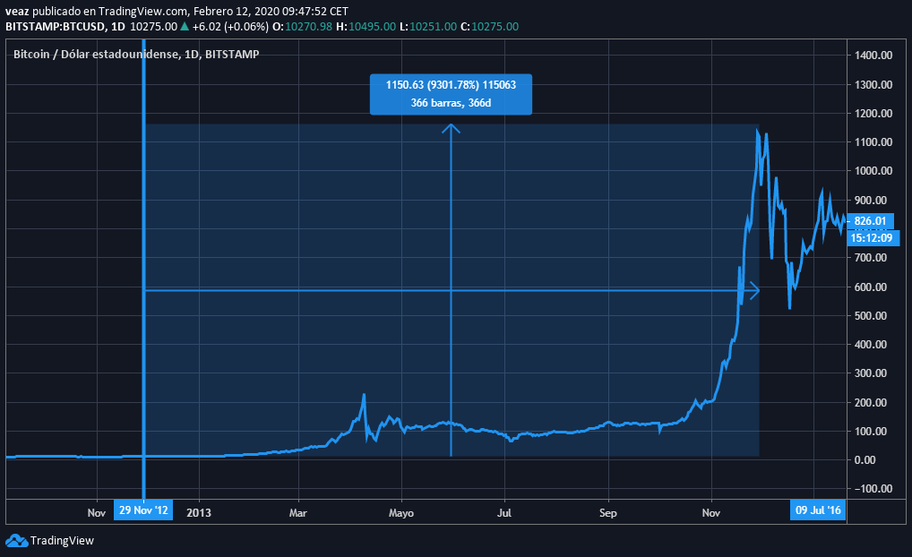

Estamos a pocos meses del próximo halving de Bitcoin el 3ero en su corta historia, nadie sabe con exactitud qué podría pasar, la mayoría especulan el precio con predicciones de un 1000 % modestamente, algo que no ocurrirá de un día para otro, por más que nos guste esta idea el tiempo nos ha demostrado que la paciencia es la que paga y este proceso puede demorar años. 

Un poco de historia

El primer halving ocurrió en el 29 de Noviembre del 2012, la recompensa por bloque minado fue reducida de 50 a 25 Bitcoins, el precio de bitcoin de apenas era de $ 12 y luego de 366 dias llego a su precio mas alto (All time high) llegando a valorarse en $ 1163, un imcremento del 9301,78 % 

El segundo halving ocurrió el 9 de Julio de 2016, se redujo de 25 a 12.5 Bitcoins por bloque, el precio de bitcoin se encontraba en $ 663 y luego de 526 dias llego a su precio mas alto de $ 19.666, subio mas de 2866,21%

El tercer halving ocurrirá aproximadamente el 12 de mayo del 2020, la recompensa por bloque minado actualmente es de 12.5 y se reducira 6.25 Bitcoin por bloque.

Viendo las gráficas y conociendo los ciclos del mercado, podemos notar que el halving ha marcado el inicio del mercado alcista tambien conocido como bull run en ingles, toda la comunidad esta ansiosa por este momento, queremos que llegue y al mismo tiempo no, solo para acumular más satoshis.

Todo aquel consciente de lo importante que puede llegar a pasar este y el próximo año debido al halving vive en una ansiedad prolongada, atentos a lo que nos depara en los próximos años, que este primer texto que escribo quede para la inmortalidad.

¿Tienes dudas o comentarios?
Sientete libre de enviarme un [¡tweet!](https://twitter.com/criptoveaz)

